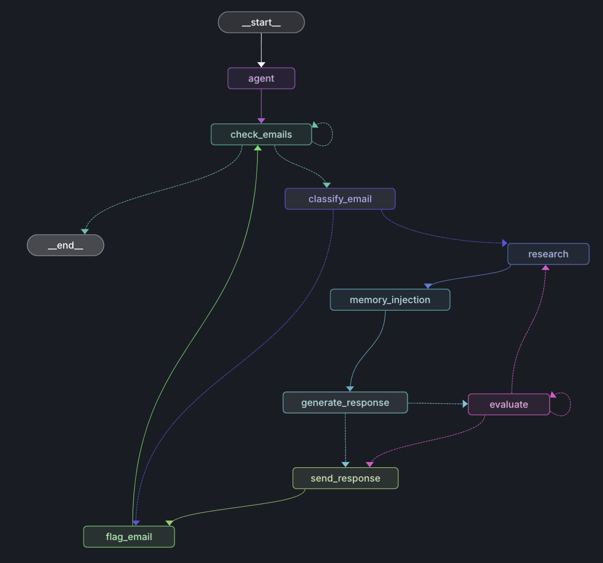

# Gmail Agent

This project consists of a Gmail Agent application with a React frontend and Express backend, using Supabase for data storage.



## Project Structure

The project is organized into the following directories:

- `frontend/`: React application for user registration
- `backend/`: Express API server for handling user data
- `my_agent/`: LangGraph agent for Gmail automation

## Frontend

The frontend is built with React and Vite, allowing users to:
- Enter their name, Gmail address, and phone number
- Submit their information to be stored in Supabase

### Running the Frontend

```bash
cd frontend
npm install
# Create .env file with required variables
npm run dev
```

### Deploying the Frontend to Vercel

The frontend is configured for deployment on Vercel:

1. Push your code to a GitHub repository
2. Go to [Vercel](https://vercel.com) and sign up or log in
3. Click "New Project" and import your GitHub repository
4. Configure the project:
   - Set the framework preset to "Vite"
   - Set the root directory to "frontend"
   - Add the environment variable `VITE_API_URL` pointing to your deployed backend
5. Click "Deploy"

## Backend

The backend is an Express server that:
- Validates user input
- Stores data in Supabase
- Provides API endpoints for the frontend

### Running the Backend

```bash
cd backend
npm install
# Create .env file with required variables
npm run dev
```

## Supabase Setup

To use the application, you need to set up a Supabase project:

1. Create a new project at [https://supabase.com](https://supabase.com)
2. Create a table called `User Info` with columns:
   - `id` (uuid, primary key)
   - `created_at` (timestamp with time zone, default now())
   - `Name` (text, not null)
   - `Gmail Account` (text, not null)
   - `Phone Number` (text, not null)
3. Set up environment variables for both frontend and backend

## Gmail Agent

The original Gmail Agent (in `my_agent/`) is built with LangGraph and provides automated Gmail processing capabilities. See the LangGraph documentation for more information on this component.

## Environment Variables

### Frontend (.env file)
```
VITE_API_URL=http://localhost:8000/api
```

### Backend (.env file)
```
PORT=8000
SUPABASE_URL=your-supabase-url-here
SUPABASE_SERVICE_KEY=your-supabase-service-key-here
```
